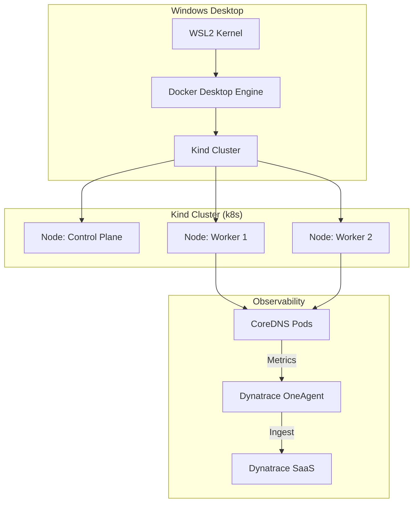

# Lab Architecture Overview

This project simulates a complete Enterprise Kubernetes Monitoring stack on your local laptop.

## Components
1.  **Windows Host**: The physical machine running the simulation.
2.  **Kind**: "Kubernetes in Docker". Creates containerized "Nodes".
3.  **ActiveGate / OneAgent**: The Dynatrace components that capture data.
4.  **CoreDNS**: The target application we are monitoring.
